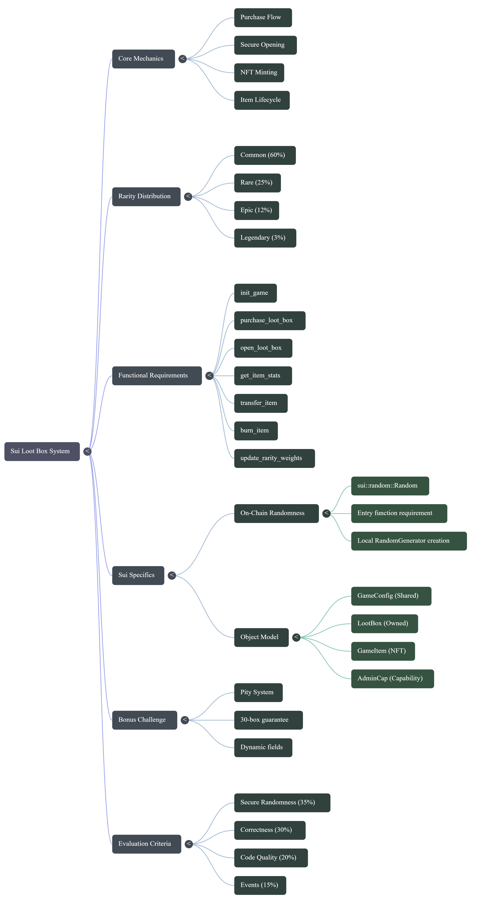

# 🎮 Sui Decentralized Loot Box System

## 🚀 Quick Pitch / Project Summary

[](https://github.com/Aazen45v/loot-box-system/blob/main/Loot_Box_Explained.mp4)

**1. The Introduction (What it is)**
For problem statement #2, I built a decentralized Loot Box system on the Sui blockchain. It allows users to pay 1000 SUI to receive a sealed Loot Box. They can then securely open it to mint an NFT with different rarity tiers: Common, Rare, Epic, and Legendary.

**2. The Security (The biggest technical achievement)**
The hardest part of Web3 gaming is preventing players from gaming the system by aborting transactions if they don't get the item they want. I solved this by using Sui's on-chain randomness (`sui::random`). I made the `open_loot_box` method a `private entry` function which strictly prevents other contracts from looking at the random outcome and reversing the transaction. It's mathematically fair.

**3. The Object Architecture (Demonstrating Sui knowledge)**
I took full advantage of Sui's object model to optimize gas and security. The game's settings and treasury are held in a **Shared Object** so everyone can interact with it, while the Loot Boxes and the final minted NFT Items are **Owned Objects** that go directly to the player's wallet.

**4. The Bonus Challenge (Going above and beyond)**
To make the game economy fairer, I also implemented the bonus challenge: a Pity System. I used Sui's `dynamic_fields` to attach a counter to each specific player's address. If a player opens 30 loot boxes in a row without getting a Legendary item, the contract bypasses the randomness entirely and gives them a guaranteed 100% Legendary drop on their 31st try.

---

## 1. System Overview & Architecture

This repository presents a production-grade implementation of a non-custodial **Loot Box System** engineered for the Sui blockchain. Developed as a solution for the Alkimi Hackathon Phase II (Problem Statement #2: Gaming), this system demonstrates the secure integration of verifiable on-chain randomness (`sui::random`), Sui's unique object-centric architecture, and a dynamic state-tracking "Pity" system for balanced game economies.

> **📽️ Graphical Presentation**
> For a high-level, visual explanation of the system, mechanics, and design philosophy, please review our official graphical presentation here: 
> [**Loot_Boxes_Presentation.pdf**](https://github.com/Aazen45v/loot-box-system/blob/main/Loot_Boxes_Presentation.pdf)

Our architecture is designed around several key principles:
1. **Mathematical Fairness**: Secure entropy consumption eliminating "reroll" or composability attacks.
2. **Object Autonomy**: Strict delineation between shared application state (`GameConfig`) and user-owned assets (`LootBox`, `GameItem`).
3. **Economic Determinism**: Exacting drop rates, predictable power-level bounds, and stateful adjustments for edge-case player luck variance.

---

## 2. Secure On-Chain Randomness (Cryptographic Integrity)

The most critical vulnerability in Web3 gaming drop mechanics is the exploitation of pseudo-randomness or atomic transaction reversibility (Composability/Reroll attacks).

Our implementation completely neutralizes these threats through the `sui::random` module provided natively at the protocol address `0x8`. 

### The `entry` Function Constraint
The core logic for minting an NFT resides in `open_loot_box`. By explicitly marking this as a `private entry` function, we forcefully break composability. It guarantees that:
- `open_loot_box` **cannot** be called from within another smart contract.
- It **cannot** be nested inside a complex Programmable Transaction Block (PTB) where a malicious actor evaluates the result of the randomized mint and dynamically decides whether to abort the overall transaction to refund their loot box cost.

### Secure Generator Instantiation
Furthermore, the `RandomGenerator` is never passed as a parameter. It is created strictly within the local execution scope:
```move
let mut gen = random::new_generator(r, ctx);
```
Entropy is immediately generated via `generate_u8_in_range(&mut gen, 0, 99)`. This ensures uniformity and prevents external manipulation of the randomness seed state.

---

## 3. Object Model Deep Dive

We heavily leverage Sui's robust object model, distinguishing carefully between `key` and `store` abilities to strictly enforce access controls and asset liquidity.

### `GameConfig<T>` (Shared Object)
- **Abilities**: `key`
- **Purpose**: The global singleton coordinating the game's state. It manages dynamic rarity weights, sets the global loot box pricing (e.g., 1000 SUI default), and holds the `Balance<T>` representing the game's accumulated treasury.
- **Access**: Shared widely to allow concurrent read access and strictly controlled mutable access during user purchases.

### `LootBox` (Owned Object)
- **Abilities**: `key`, `store`
- **Purpose**: Represents an unrevealed, hermetically sealed container purchased by the user. Once generated, it exists as a discrete digital asset that must be explicitly destroyed (burned) as a required argument constraint to execute the `open_loot_box` RNG consumption.

### `GameItem` (Owned NFT)
- **Abilities**: `key`, `store`
- **Purpose**: The final generated weapon/item. It possesses `store`, meaning players can trade it on secondary marketplaces, escrow it, or nest it inside other Sui objects (like an inventory object).

### `AdminCap` (Capability Object)
- **Abilities**: `key`, `store`
- **Purpose**: An administrative bearer token issued exclusively to the package publisher directly resulting from `init_game`. Functions like `update_rarity_weights` demand this capability by reference to restrict unauthorized economic shifts.

---

## 4. Economic Mechanics & Purchase Flow

The user journey begins with a token transfer. The `purchase_loot_box` function accepts a generalized `Coin<T>` (where `T` is `sui::sui::SUI`).
1. **Validation**: The contract asserts the user has supplied tokens greater than or equal to the configured price.
2. **Treasury Management**: The exact `1000` balance is mathematically split from the provided coin and injected into the `GameConfig`'s internal `Balance<T>` treasury vault.
3. **Change Handling**: Any leftover tokens provided by the user are immediately returned to the sender.
4. **Issuance**: Finally, the system mints and transfers the owned `LootBox` directly to the `TxContext::sender`.

---

## 5. Rarity Mathematics & Power Distribution

The outcome is determined by mapping a cryptographically secure random uniform integer $n \in [0, 99]$ across discrete probabilistic brackets. The initial `GameConfig` defines these brackets, representing the following baseline drop rates:

| Rarity Tier | Drop Rate (Weight) | $n$ Interval Boundary | Stat Power Distribution | Minted Name Example |
| :--- | :--- | :--- | :--- | :--- |
| **Common** | 60% | $0 \le n \le 59$ | Uniform: $1 \rightarrow 10$ | `Common Item` |
| **Rare** | 25% | $60 \le n \le 84$ | Uniform: $11 \rightarrow 25$ | `Rare Item` |
| **Epic** | 12% | $85 \le n \le 96$ | Uniform: $26 \rightarrow 40$ | `Epic Item` |
| **Legendary** | 3% | $97 \le n \le 99$ | Uniform: $41 \rightarrow 50$ | `Legendary Item` |

A secondary call to the `RandomGenerator` subsequently evaluates the `Power` integer based strictly on the bounded limits for the selected rarity tier. Admin controls (`update_rarity_weights`) are hardcoded to assert that weight alterations explicitly vector a sum of exactly $100$ to maintain probabilistic validity.

---

## 6. The Stateful "Pity" Guarantee (Advanced Logic)

To correct for standard variance anomalies ("bad luck streaks"), we implemented a deterministic pity mechanic. It functions without bloating the core object structs by securely anchoring variables to the `GameConfig` shared object via **Dynamic Fields**.

- **Tracking Mechanism**: The system dynamically attaches a `u8` counter specifically mapped to the user's `address` upon their first interaction.
- **Incrementation**: With every non-Legendary (`rarity < 3`) roll, the counter increments and is persisted to the global state tree.
- **Intervention Point**: If the system detects `user_counter >= 30` dynamically mapped against `TxContext::sender`, it bypasses the random number generation matrix entirely. It hardcodes the outcome mapping strictly to `Legendary`.
- **Reset Trigger**: Whether achieved organically via RNG or triggered deterministically by the 30-roll intervention, the user's dynamic field counter is wiped directly back to 0.

---

## 7. Operational Event Emitters

For robust off-chain indexer visibility, the system utilizes Sui’s event system. Upon minting the final `GameItem`, an explicit `LootBoxOpened` event schema is emitted:
```move
public struct LootBoxOpened has copy, drop {
    item_id: ID,       // The globally unique identifier of the generated NFT
    rarity: u8,        // The assigned integer tier
    power: u8,         // The calculated power output mapping
    owner: address,    // The receiving user
}
```

---

## 8. Compilation & Deployment Execution

This package comprises backend protocols and test wrappers meant to be executed natively via the Sui CLI toolkit.

### 8.1 Test Execution Suite Framework
The system possesses 8 rigorously defined deterministic tests covering edge-cases such as testing transaction rejections when user token liquidity drops `<1000 SUI`, assessing random logic branches using mocked protocol randomness inputs (`random::create_for_testing`), and evaluating object lifespans natively on memory contexts.
```bash
# Execute Full Test Matrix
sui move test

# Perform verbose transaction path tracing
sui move test --gas-profiling
```

### 8.2 Build & Publish Protocols
```bash
# Validate bytecode compliance
sui move build

# Publish to targeted Testnet Node configurations
sui client publish --gas-budget 100000000
```

---

### 9. Architectural Mind Map

The visual hierarchy of the implemented structural properties:

